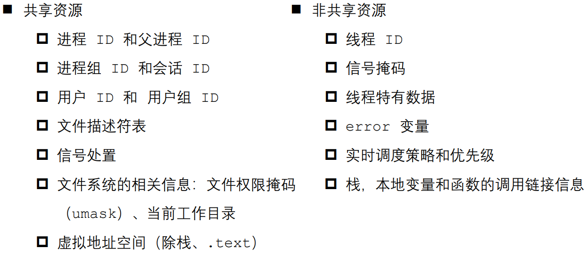

# scheduling
for deterministic scheduing
本仓库所做的内容均是基于Linux系统，以确定性调度为导向开发的。 进程是 CPU 分配资源的最小单位，线程是操作系统调度执行的最小单位。 
查看指定进程的 LWP 号：ps –Lf pid
线程之间共享和非共享资源

 Linux 线程的一个新实现,NPTL(Net POSIX Thread Library)

◼ 
pthread_create函数：

1、简介：pthread_create是UNIX环境创建线程的函数

2、头文件：#include <pthread.h>

3、函数声明：

int pthread_create(pthread_t *thread, const pthread_attr_t *attr,
                          void *(*start_routine) (void *), void *arg);

    Compile and link with -pthread.

4、输入参数：（以下做简介，具体参见实例一目了然）

（1）thread：事先创建好的pthread_t类型的参数。成功时tidp指向的内存单元被设置为新创建线程的线程ID。

（2）attr：用于定制各种不同的线程属性。通常直接设为NULL。

（3）start_routine：新创建线程从此函数开始运行。无参数是arg设为NULL即可。

（4）arg：start_routine函数的参数。无参数时设为NULL即可。有参数时输入参数的地址。当多于一个参数时应当使用结构体传入。（以下举例）

5、返回值：成功返回0，否则返回错误码。

◼ pthread_t pthread_self(void); //获取当前线程id

◼ int pthread_equal(pthread_t t1, pthread_t t2); //比较两线程id是否相等

◼ void pthread_exit(void *retval);//退出当前线程
pthread_exit(NULL)用于线程退出，可以指定返回值，以便其他线程通过pthread_join()函数获取该线程的返回值.pthread_exit()代码后面的代码不会被执行，即使在主线程中使用也是这样。

return，是函数返回，return会调用局部对象的析构函数，而pthread_exit不会.在main()函数中写return，会被编译器优化，也会像exit一样直接杀死所有进程.用pthread_exit只会使主线程自身退出，产生的子线程继续执行；用return则所有线程退出

exit()是进程退出，如果在线程函数中调用exit，那该线程的进程也就挂了,会导致该线程所在进程的其他线程也挂掉，比较严重

◼ int pthread_join(pthread_t thread, void **retval);//连接已终止的子线程回收资源

◼ int pthread_detach(pthread_t thread); //分离线程，进程结束时系统回收其资源

◼ int pthread_cancel(pthread_t thread); //当线程执行到取消点时终止线程